# ResumeAI

## Overview

The project is a MEAN project and uses node version 18.

## Step 1: Set Up Google Cloud Shell Environment:
- Go to the GCP console: https://console.cloud.google.com

- Click on the terminal icon (Google Cloud Shell) at the top-right corner:

## 2. Set the GCP project:

- gcloud config set project [PROJECT_ID]

## 3. Enable required APIs: Enable the Google Kubernetes Engine (GKE) and Google 
- Container Registry (GCR) APIs: gcloud services enable container.googleapis.com
- gcloud services enable containerregistry.googleapis.com

- Step 2: Create a GKE Cluster:
- Create the GKE cluster: Run the following command in Cloud Shell to create a 3-node GKE cluster in the specified zone: 

gcloud container clusters create mern-cluster --zone us-central1-a --num-nodes=3

## 2. Get cluster credentials: Fetch the credentials for your newly created cluster:
gcloud container clusters get-credentials mern-cluster --zone us-central1-c

## Step 3: Clone the MEAN Application Repository:
Clone the Sample MERN application: In Cloud Shell, clone the GitHub repository:

## Step 4: Build and Push Docker ReadMe_Images/images to Google Container Registry (GCR)

Authenticate with GCR:

gcloud auth configure-docker

- Created pipeline on jenkins server.
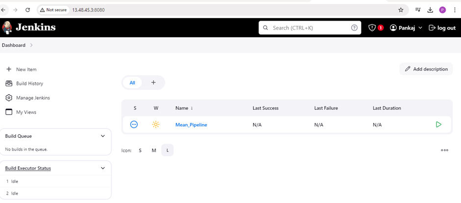
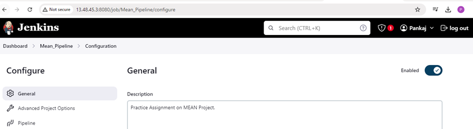
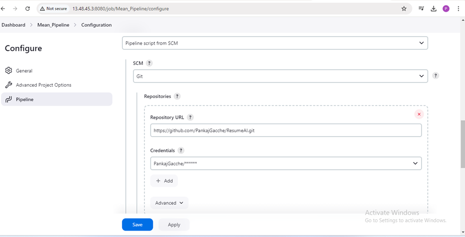
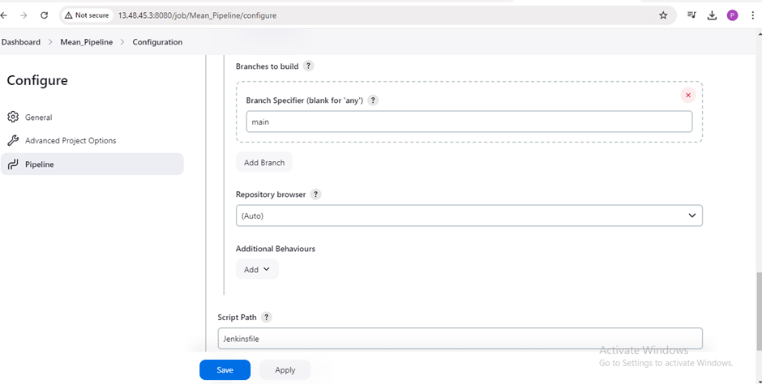

- Created jenkins file and push to github repository.
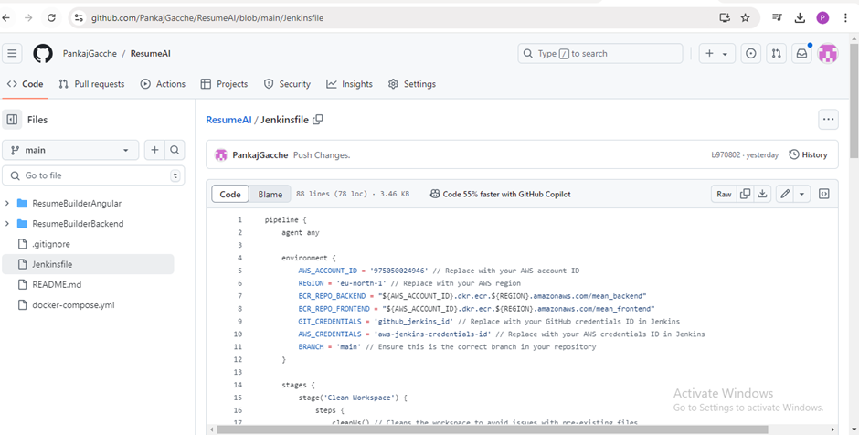
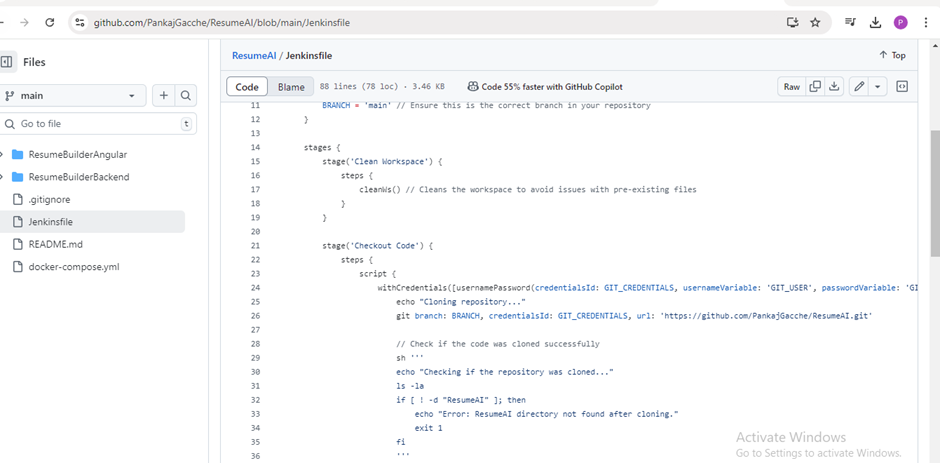
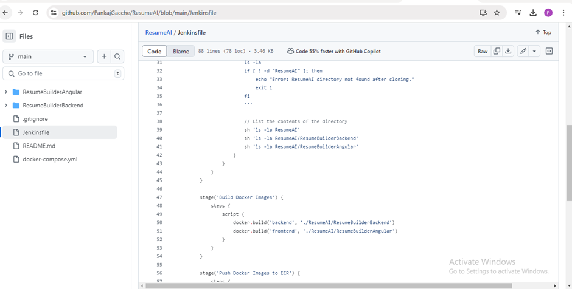
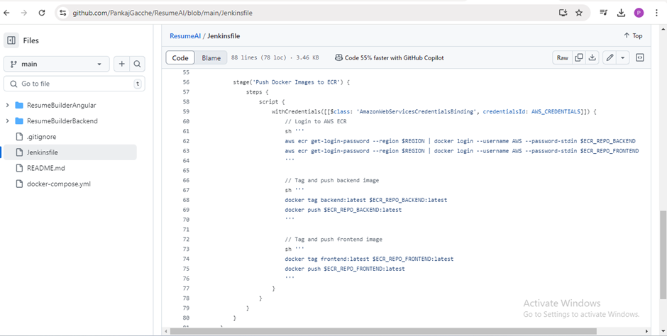
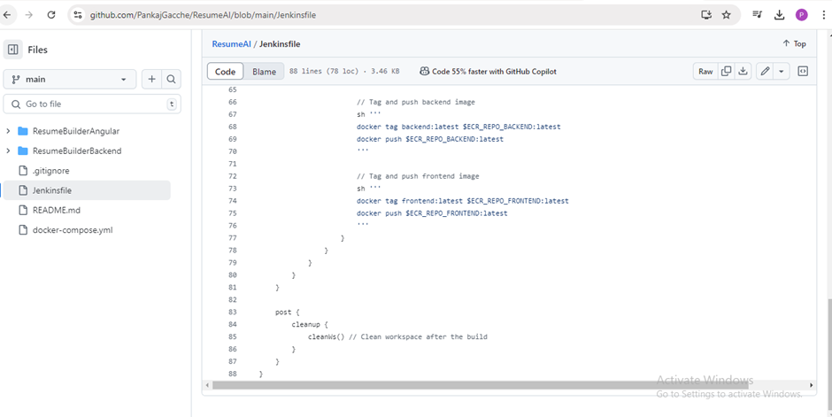

- Run jenkins pipeline.
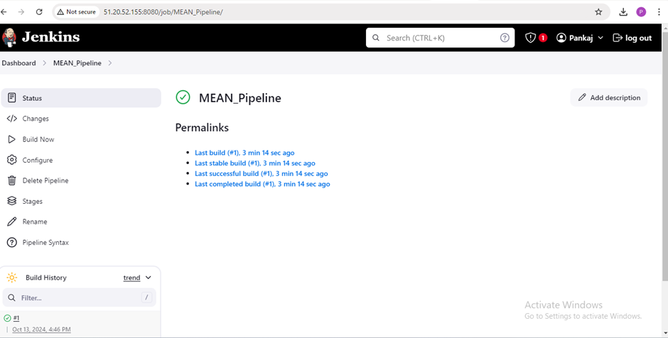
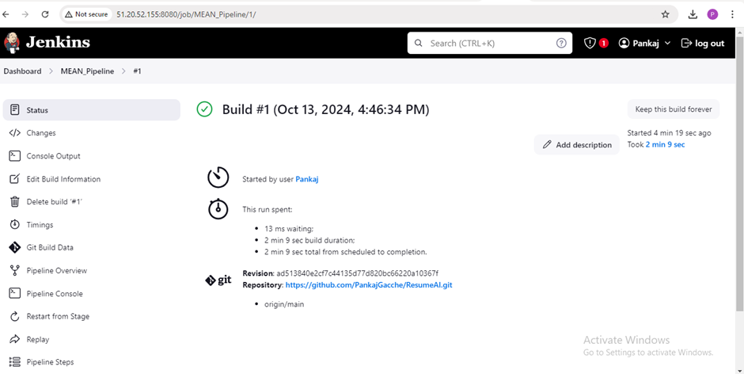
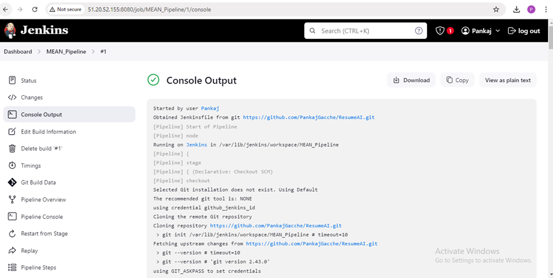
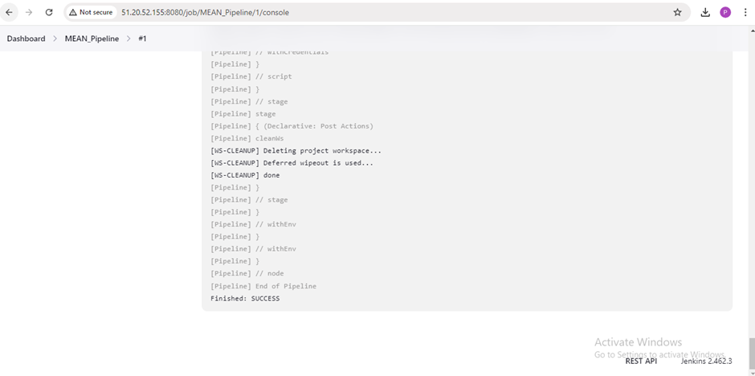

- Build images via jenkins file and pushed to ECR.
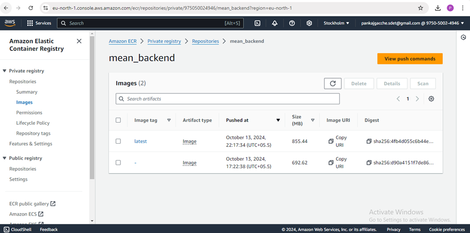
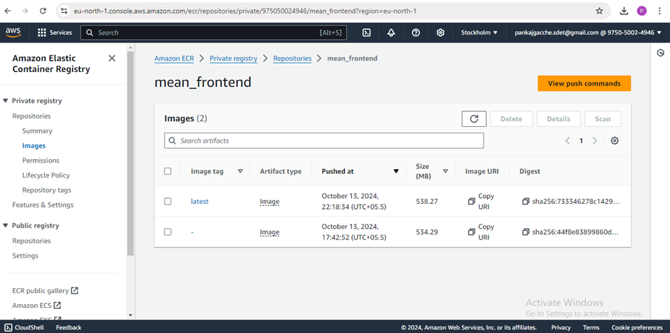

- Deploying mean application using Minikube.
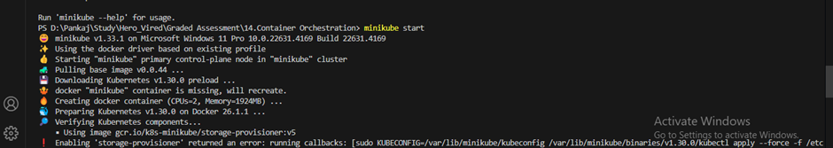

- Login AWS account via cmd.
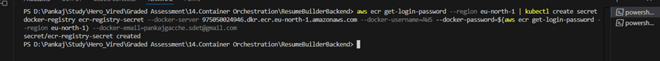

- Apply .yaml files on minikube cluser and deployed application successfully.
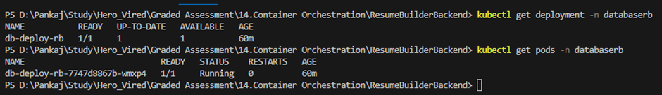
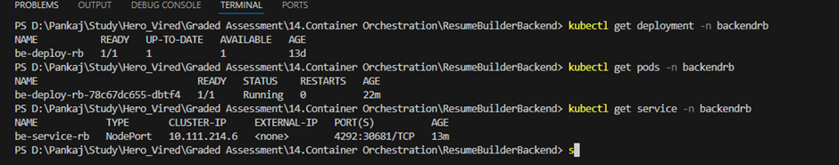
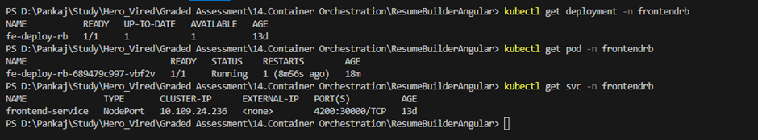

- Now deploying mean application using Eks.
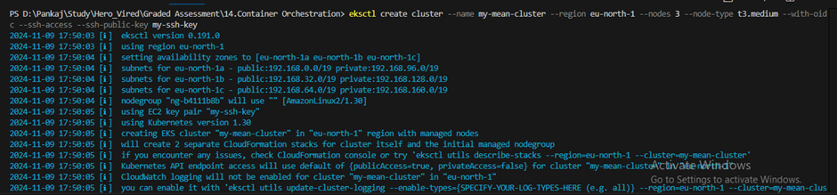
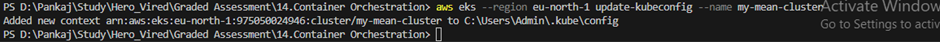

- Apply .yaml files on Eks cluser and deployed application successfully.
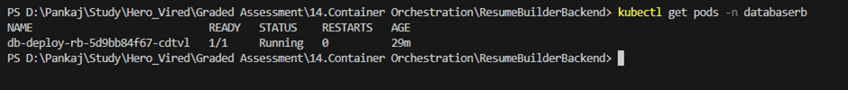
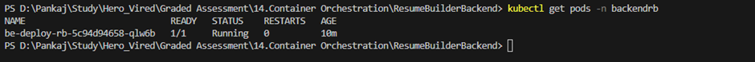
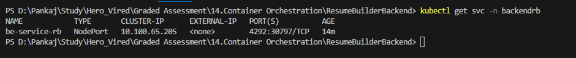
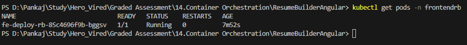
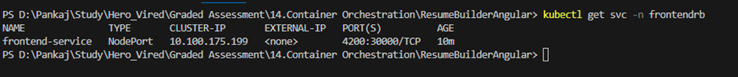

- Verified deployment created on Eks cluster.
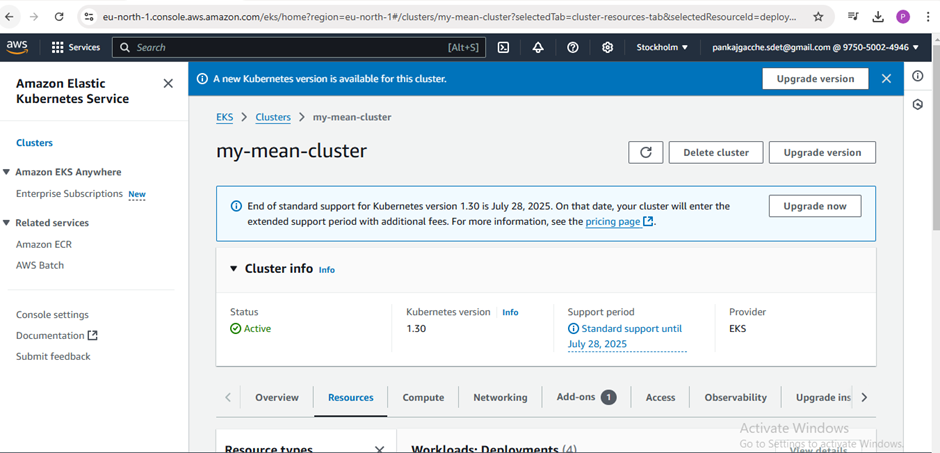

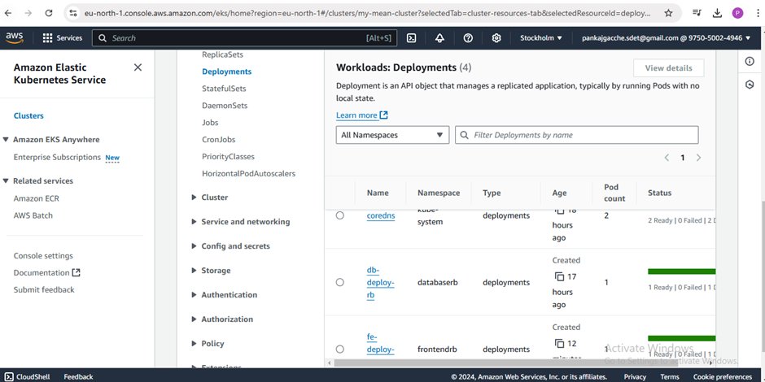

