# ResumeAI

## Overview

The project is a MEAN project and uses node version 18.

## Step 1: Set Up Google Cloud Shell Environment:
- Go to the GCP console: https://console.cloud.google.com

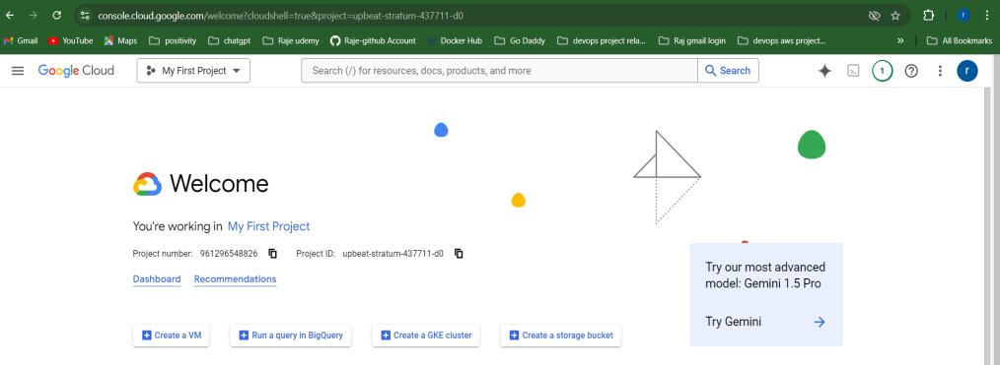

- Click on the terminal icon (Google Cloud Shell) at the top-right corner:

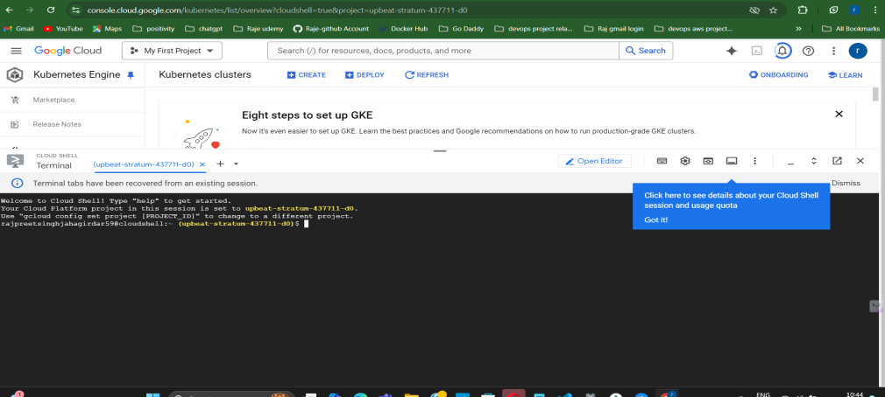

## 2. Set the GCP project:

- gcloud config set project [PROJECT_ID]

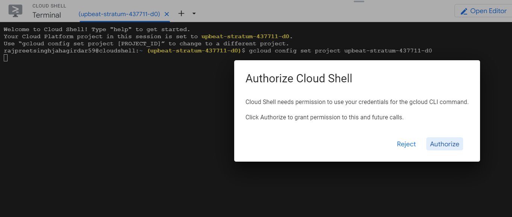

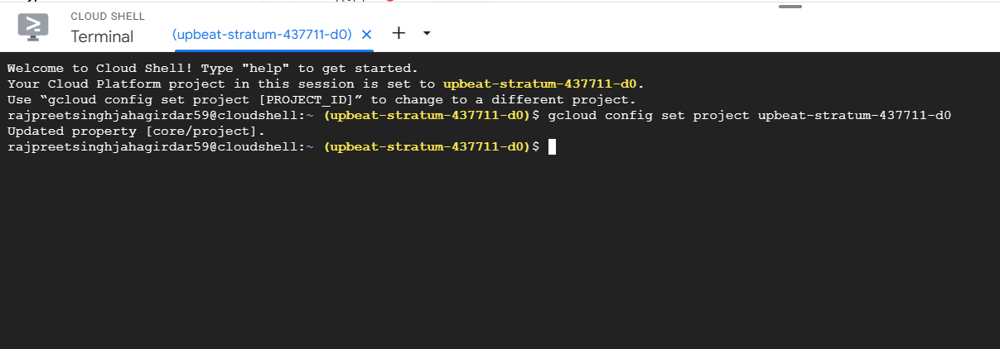

## 3. Enable required APIs: Enable the Google Kubernetes Engine (GKE) and Google 
- Container Registry (GCR) APIs: gcloud services enable container.googleapis.com
- gcloud services enable containerregistry.googleapis.com

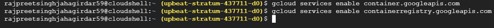

- Step 2: Create a GKE Cluster:
- Create the GKE cluster: Run the following command in Cloud Shell to create a 3-node GKE cluster in the specified zone: 

gcloud container clusters create mern-cluster --zone us-central1-a --num-nodes=3

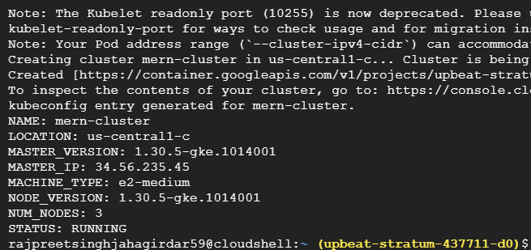
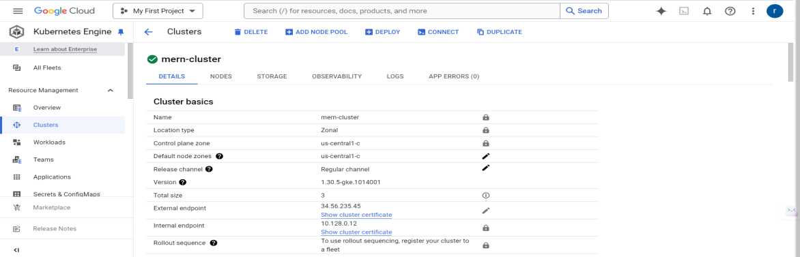

## 2. Get cluster credentials: Fetch the credentials for your newly created cluster:
gcloud container clusters get-credentials mern-cluster --zone us-central1-c

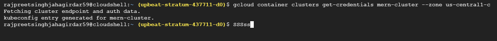

## Step 3: Clone the MEAN Application Repository:
Clone the Sample MERN application: In Cloud Shell, clone the GitHub repository:

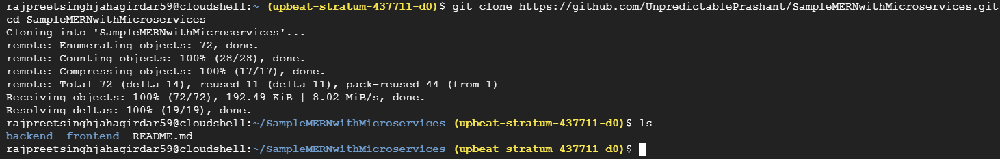

## Step 4: Build and Push Docker ReadMe_Images/images to Google Container Registry (GCR)

Authenticate with GCR:

gcloud auth configure-docker
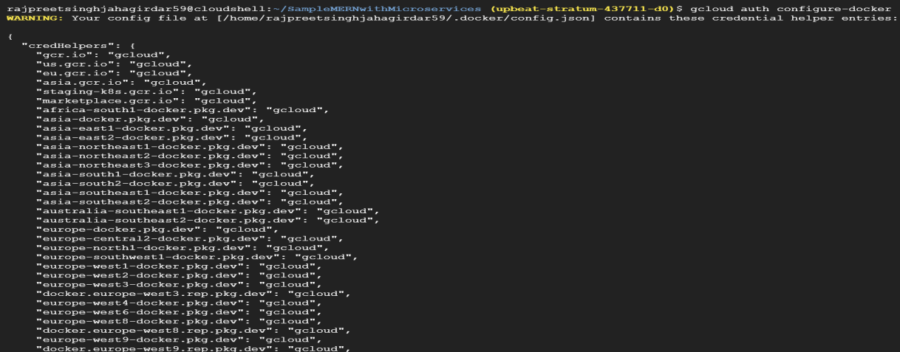

## Step5. Integrate Prometheus for Node.js Backend Metrics:

## 2. Integrate Prometheus for Node.js Backend Metrics:

- Step 1: Install Prometheus client library
In the backend, install the Prometheus client for Node.js. By hitting below command “npm install prom-client".

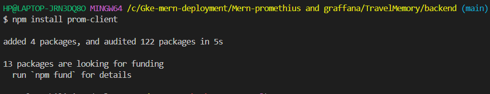

- Step 2: Expose Prometheus metrics
In your backend/server.js, import the prom-client package and expose metrics like API response times, request counts, and error rates.

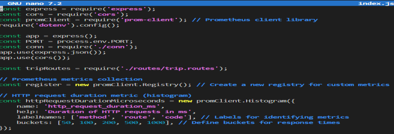

- Step 3: Set up MongoDB monitoring
- Use MongoDB Exporter to monitor the database.

- Install MongoDB Exporter:
  “docker run -d --name mongodb_exporter -p 9216:9216 bitnami/mongodb-exporter”

- Configure Prometheus to scrape MongoDB metrics.

- Step 4: Configure Prometheus:
- Set up a prometheus.yml configuration file to scrape your Node.js backend and MongoDB exporter.
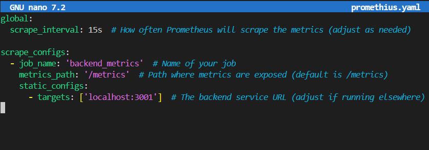

## 3. Enhance Grafana Dashboards

- Step 1: Install and set up Grafana
- Install Grafana and configure Prometheus as a data source.
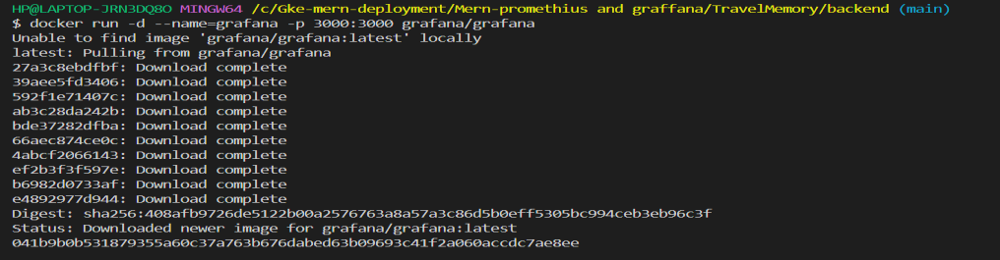

- Open Grafana UI at http://localhost:3000
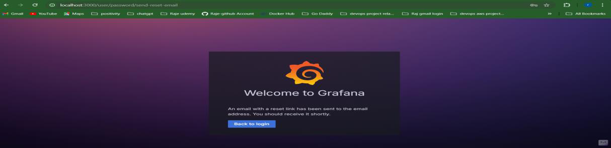
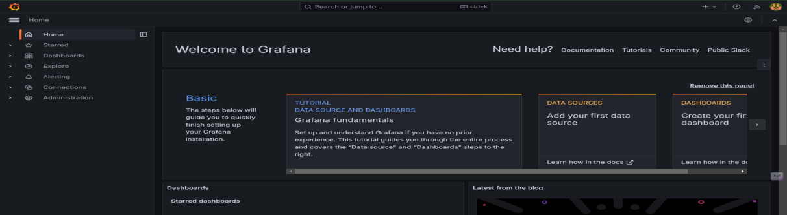

- Needs to login as admin in uername and password section you need to hit admin as well then you can change you password to your choice and proceeed further.

- Step 3: Create Dashboards:
- Create custom dashboards in Grafana for:
- MongoDB health (connections, memory usage, query time)
- Frontend performance (use Prometheus metrics if applicable)

## 4. Log Aggregation with Loki:
- Step 1: Install Loki and Promtail
- Use Loki for log aggregation.
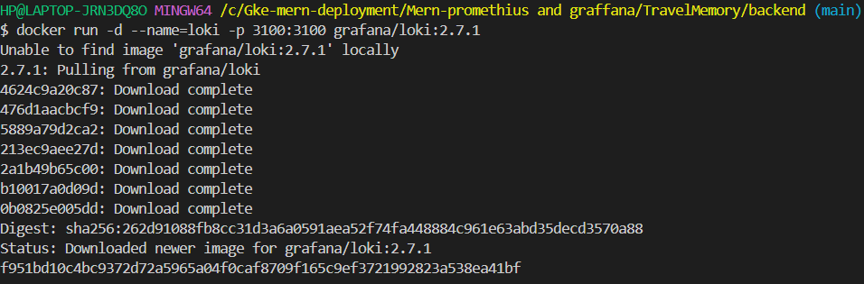
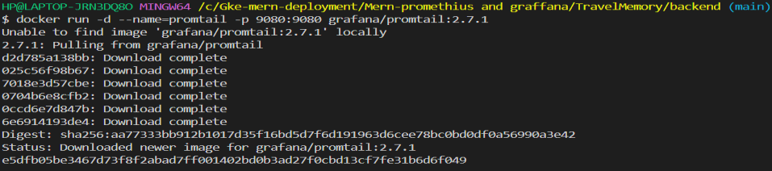

- Step 2: Configure Prom tail to collect logs:
- Create a promtail-config.yml file to scrape logs from your Node.js application.

- Step 3: Create Grafana Dashboard for logs:
- Add Loki as a data source in Grafana.
- Create dashboards to visualize logs in Grafana.

## 5. Implement Distributed Tracing with Jaeger:
- Step 1: Install Jaeger
- Run Jaeger as a Docker container.

docker run -d --name=jaeger -e COLLECTOR_ZIPKIN_HTTP_PORT=9411 -p 5775:5775/udp \
-p 6831:6831/udp -p 6832:6832/udp -p 5778:5778 \
-p 16686:16686 -p 14268:14268 -p 14250:14250 \
-p 9411:9411 jaegertracing/all-in-one:1.32
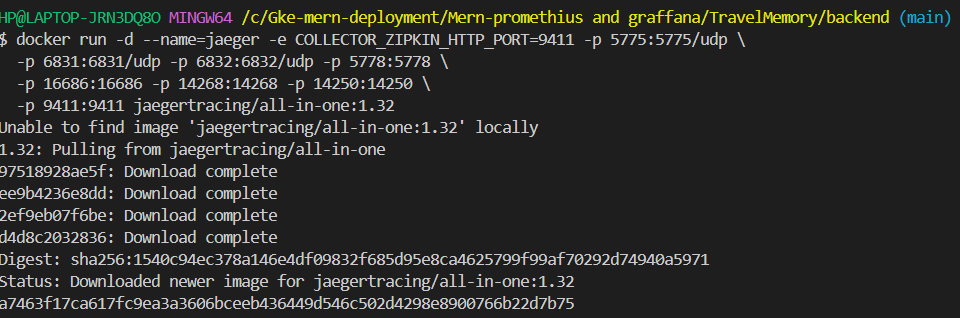

- Step 2: Integrate Jaeger with Node.js
- Use OpenTelemetry to send traces to Jaeger.
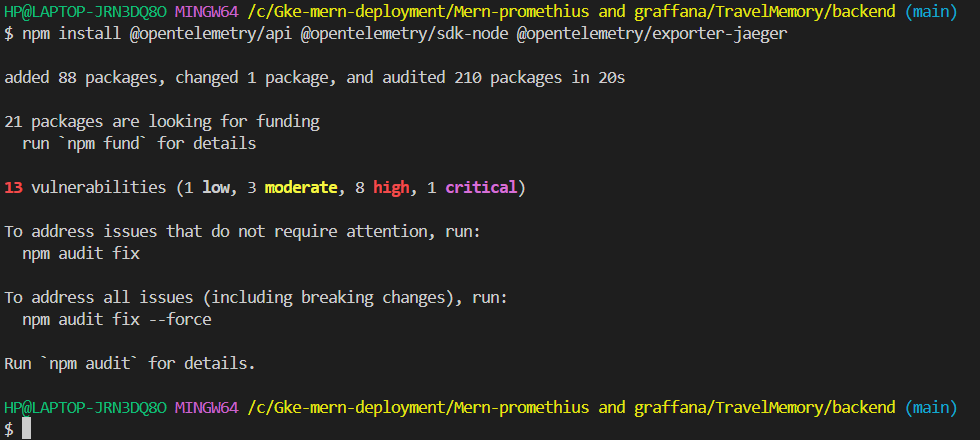

- Modify your backend to send traces to Jaeger:
- This will start Jaeger, and you can access the Jaeger UI at http://localhost:16686
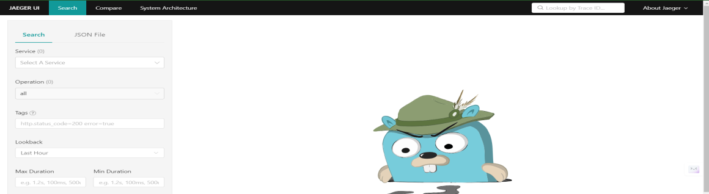

- Step 1: Install OpenTelemetry for Node.js
- Installed the necessary OpenTelemetry libraries for tracing:
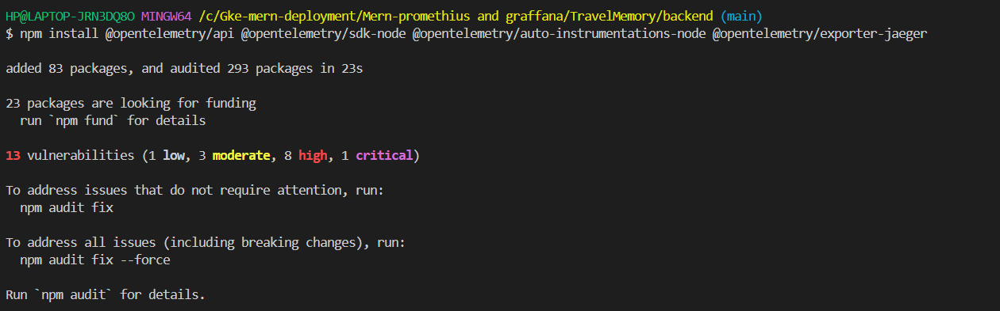

Step 3: Modify index.js to Enable Tracing:

- Create a new file (optional for better organization): Create a file named tracing.js to configure OpenTelemetry. This will keep your code cleaner.
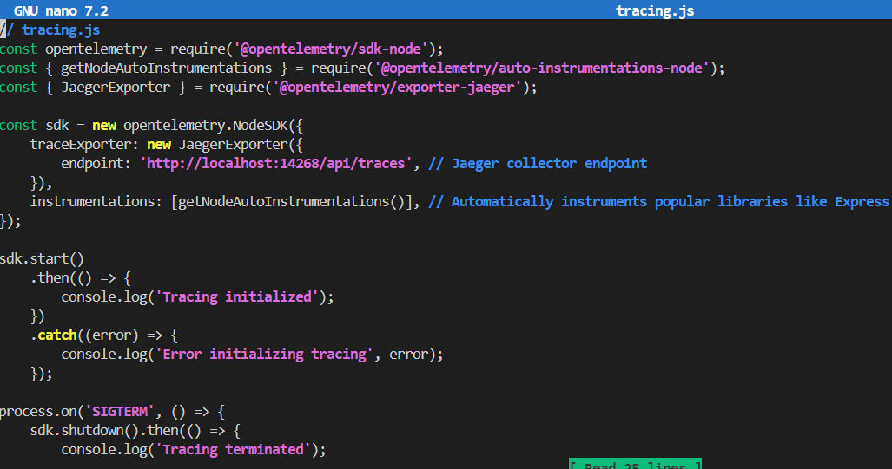

- 2. Modify index.js: Import tracing.js at the top of your index.js file so that the tracing is initialized when the backend starts.
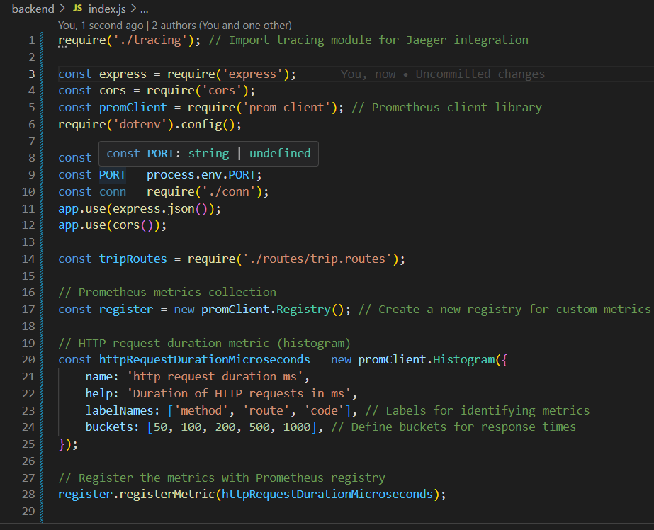

## 6. Alerting and Anomaly Detection:
- Step 1: Create Alerting Rules
- Set up alerting rules in Prometheus for application-specific metrics, such as response time exceeding a threshold.

- Create the alert.rules.yml file:

- Step 2: Configure Alertmanager

- Install Alertmanager:

- Visit the official Alertmanager releases page on GitHub:
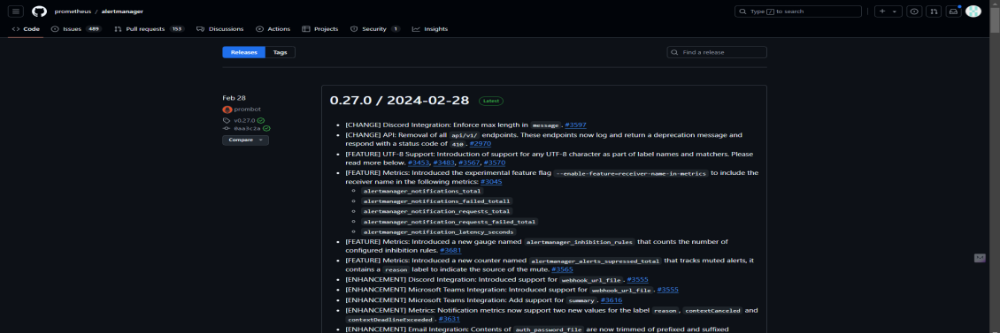

- Download the appropriate version for your system:
- alertmanager-0.27.0.illumos-amd64.tar.gz in my case.
- Example for Linux:- wget

https://github.com/prometheus/alertmanager/releases/download/v0.26.0/alertmanager-0.26.0.linux-amd64.tar.gz
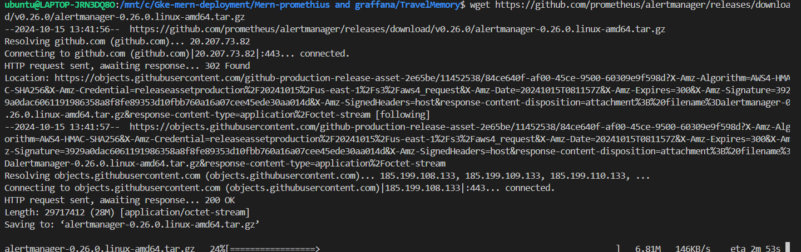

- Step 2: Extract the Files:
- Extract the downloaded file to a directory:
- For Linux/macOS:
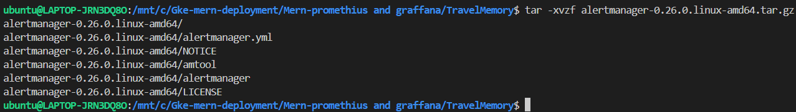

- Navigate to the extracted folder:
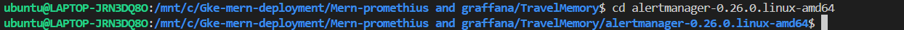

- Step 3: Configure Alertmanager:

- Create a configuration file (alertmanager.yml) in the Alertmanager directory. This file will define how Alertmanager handles and routes alerts.

- Customize the route section based on how you want the alerts to be grouped and routed. For more advanced configurations, check out the Alertmanager configuration docs.

- Step 4: Run Alertmanager:
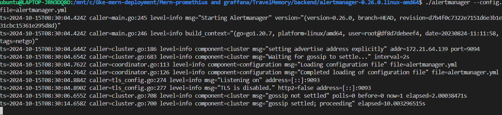
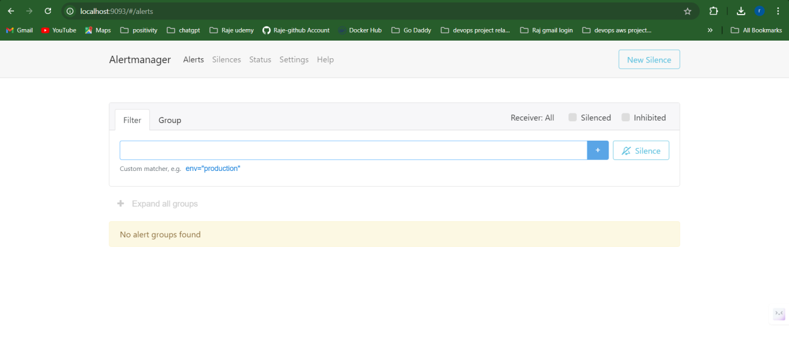

- Step 5: Integrate Alertmanager with Prometheus:

- prometheus.yml:
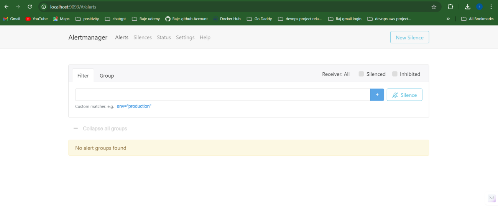
